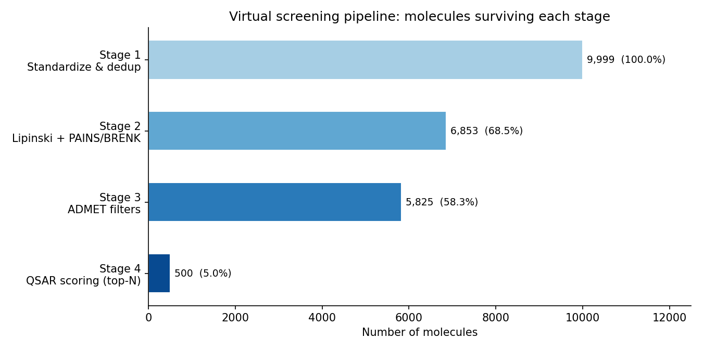
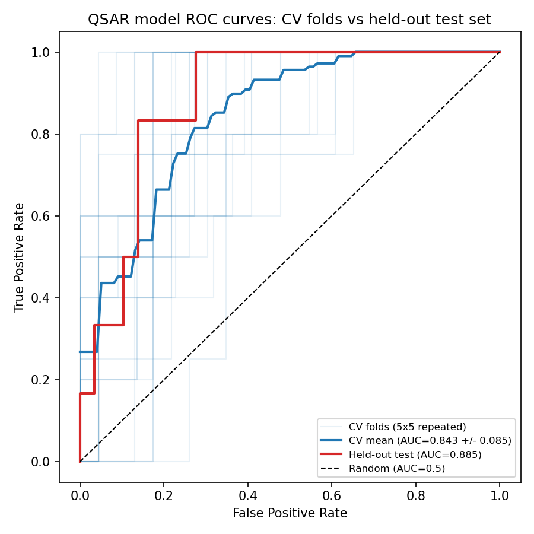
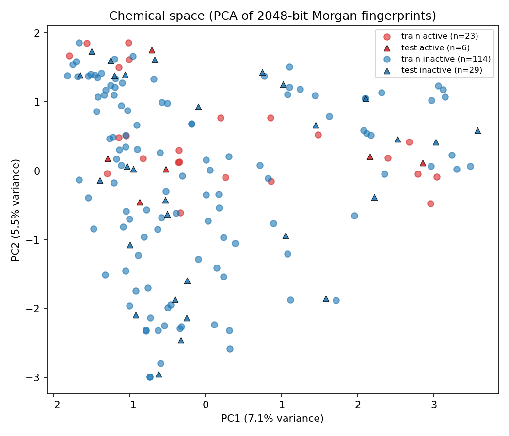
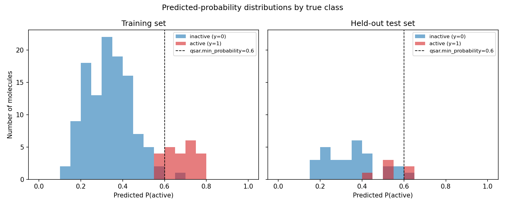
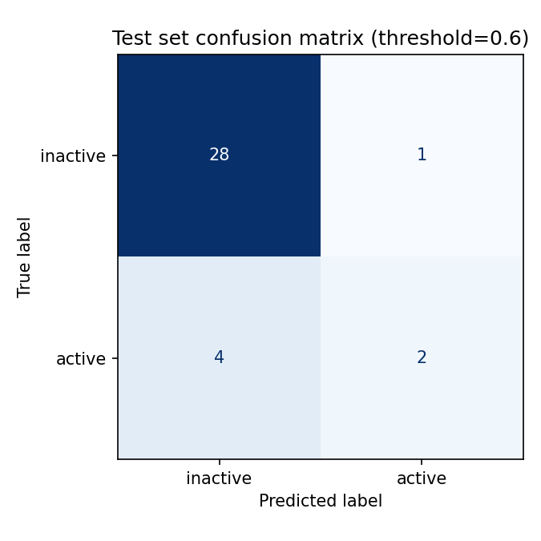
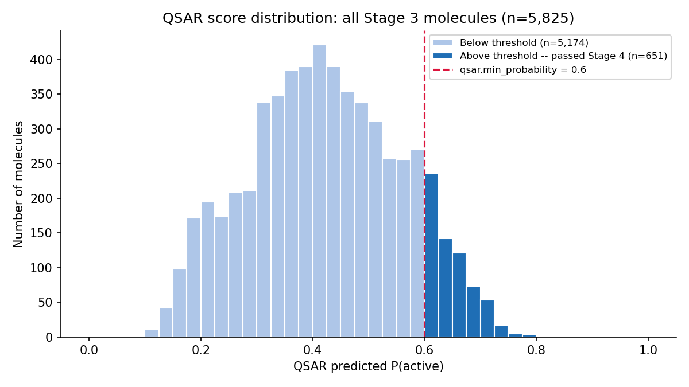
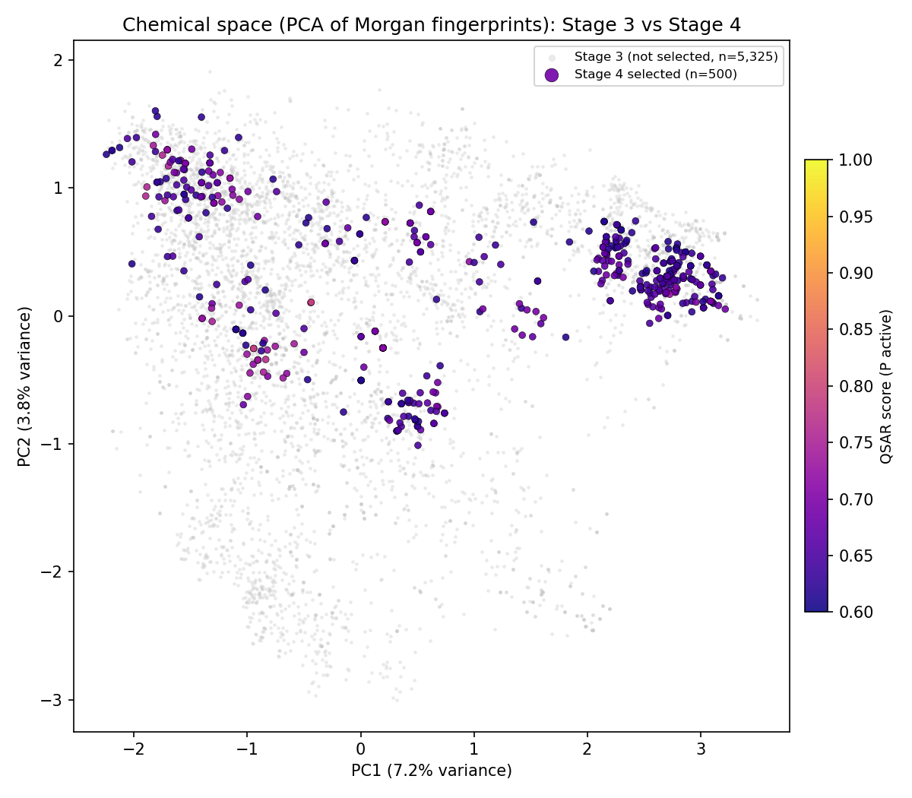
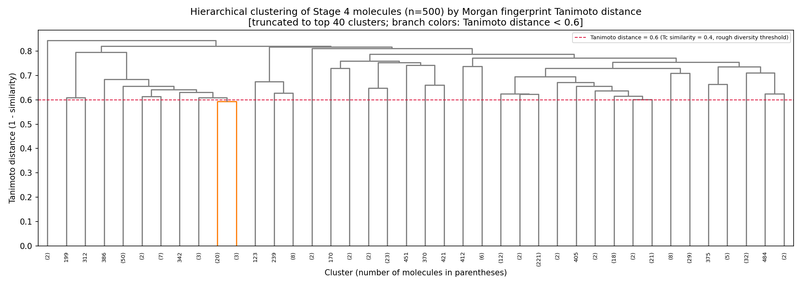

# Ligand-Based Virtual Screening Pipeline

A modular, configurable Python pipeline for structure-based virtual screening of small-molecule compound libraries. The pipeline progressively filters ~10,000 molecules through drug-likeness rules, ADMET property filters, machine-learning (QSAR) scoring, and AutoDock Vina molecular docking to identify a shortlist of high-confidence hit candidates.

## Pipeline Overview

```
  Input Library (~10,000 SMILES)
           |
   Stage 1 | Canonicalize SMILES & remove duplicates
           v
      9,999 unique molecules
           |
   Stage 2 | Lipinski / Veber rules + PAINS / BRENK alerts
           v
      6,853 molecules (68.5%)
           |
   Stage 3 | ADMET property filters (tighter thresholds + QED)
           v
      5,825 molecules (58.3%)
           |
  Stage 4a | Bootstrap: dock random 300-molecule sample
  Stage 4b | Label top 10% as actives, bottom 50% as inactives
  Stage 4c | Train RandomForest QSAR model (Morgan fingerprints)
  Stage 4d | Score full library, keep top 500 above P(active) >= 0.6
           v
        500 molecules (5.0%)
           |
   Stage 5 | AutoDock Vina docking (top 200 candidates)
           v
     Final shortlist (~50 molecules)
```



## Requirements

### Software
- **Python 3.8+**
- **AutoDock Vina** (`vina` on PATH)
- **Open Babel** (`obabel` on PATH)
- **fpocket** (optional, for blind pocket detection)

### Python Dependencies
```
rdkit
pandas
numpy
scikit-learn
joblib
pyyaml
matplotlib
scipy
```

### Input Files
- `data/input/library.csv` -- compound library with `Compound_CID` and `SMILES` columns
- `data/receptor.pdbqt` -- prepared receptor structure (e.g., FVIIa via Meeko `mk_prepare_receptor.py`)

## Configuration

All pipeline parameters are centralized in [`config.yaml`](config.yaml):

| Section | Key Parameters |
|---------|---------------|
| `input` | Library file path, ID/SMILES column names |
| `processing` | Chunk size, number of worker processes, output directory |
| `filters` | Lipinski thresholds (MW, LogP, HBD, HBA), Veber rules (RotBonds, TPSA), PAINS/BRENK toggles |
| `admet` | Tighter ADMET ranges (LogP band, TPSA band, QED minimum, aromatic ring cap) |
| `qsar` | Model path, probability threshold (0.6), top-N cap (500) |
| `docking` | Receptor path, binding pocket box (center/size), exhaustiveness, shortlist size |
| `bootstrap` | Sample size (300), active/inactive percentile splits (10%/50%) |

## Pipeline Stages

### Stage 1: Standardization & Deduplication
**Script:** [`stage1_standardize.py`](stage1_standardize.py)

Canonicalizes all SMILES strings using RDKit, removes invalid entries and exact duplicates. Processes the library in parallel chunks.

```bash
python stage1_standardize.py --config config.yaml
```

**Output:** `data/intermediate/stage1/all_standardized.parquet`

---

### Stage 2: Drug-Likeness & Structural Alert Filters
**Script:** [`stage2_filters.py`](stage2_filters.py)

Applies two layers of filtering in parallel:
1. **Lipinski's Rule of Five** -- MW <= 500, LogP <= 5, HBD <= 5, HBA <= 10
2. **Veber's rules** -- RotBonds <= 10, TPSA in [20, 140]
3. **PAINS/BRENK screening** -- removes molecules matching pan-assay interference or reactive/toxic substructure alerts

Computes and retains 2D molecular descriptors (MW, LogP, HBD, HBA, TPSA, RotBonds, QED, etc.) for downstream stages.

```bash
python stage2_filters.py --config config.yaml
```

**Output:** `data/intermediate/stage2/filtered.parquet`

---

### Stage 3: ADMET Property Filters
**Script:** [`stage3_admet.py`](stage3_admet.py)

Applies a second, tighter set of physicochemical filters as ADMET (Absorption, Distribution, Metabolism, Excretion, Toxicity) proxies:
- LogP range [-0.5, 5.0] (band, not just ceiling)
- TPSA range [40, 120] (oral absorption proxy)
- MW <= 450
- QED >= 0.3 (drug-likeness score)
- Aromatic rings <= 4

Re-uses descriptors computed in Stage 2 (no re-parsing of SMILES).

```bash
python stage3_admet.py --config config.yaml
```

**Output:** `data/intermediate/stage3/admet_passed.parquet`

---

### Stage 4a: Bootstrap Sample Docking
**Script:** [`stage4a_bootstrap_sample_dock.py`](stage4a_bootstrap_sample_dock.py)

When no experimentally-validated actives/inactives are available, this step generates pseudo-labeled training data for the QSAR model:
1. Randomly samples 300 molecules from Stage 3 output
2. Docks each against the receptor with AutoDock Vina
3. Records Vina binding-affinity scores

```bash
python stage4a_bootstrap_sample_dock.py --config config.yaml
```

**Output:** `data/intermediate/bootstrap/docked_sample.parquet`

---

### Stage 4b: Label QSAR Training Set
**Script:** [`stage4b_label_qsar_set.py`](stage4b_label_qsar_set.py)

Splits the bootstrap-docked sample into labeled sets by Vina score percentile:
- **Actives** (label=1): best-scoring 10% (most negative Vina scores)
- **Inactives** (label=0): worst-scoring 50% (least negative Vina scores)

```bash
python stage4b_label_qsar_set.py --config config.yaml
```

**Output:** `data/input/actives.csv`, `data/input/inactives.csv`

---

### Stage 4c: Train QSAR Model
**Script:** [`stage4c_train_qsar.py`](stage4c_train_qsar.py)

Trains a **RandomForestClassifier** on 2048-bit Morgan (ECFP4) fingerprints to distinguish actives from inactives. Includes overfitting-reduction measures for small, imbalanced datasets:

| Parameter | Value | Rationale |
|-----------|-------|-----------|
| `max_depth` | 8 | Prevents memorization of individual molecules |
| `min_samples_leaf` | 3 | Leaves must represent >= 3 molecules |
| `class_weight` | balanced | Corrects for ~1:5 active:inactive ratio |
| Cross-validation | 5x5 RepeatedStratifiedKFold | Stable AUC estimate with small sample sizes |

```bash
python stage4c_train_qsar.py \
    --actives data/input/actives.csv \
    --inactives data/input/inactives.csv \
    --output models/qsar_model.joblib
```

**Output:** `models/qsar_model.joblib`

---

### Stage 4ci: QSAR Model Diagnostics
**Script:** [`stage4ci_plot_qsar_results.py`](stage4ci_plot_qsar_results.py)

Generates four diagnostic plots to evaluate model performance:

```bash
python stage4ci_plot_qsar_results.py \
    --actives data/input/actives.csv \
    --inactives data/input/inactives.csv \
    --model models/qsar_model.joblib \
    --outdir results/qsar_plots
```

#### ROC Curves (CV vs Held-Out Test)
Cross-validated ROC-AUC (5x5 repeated stratified): **0.843 +/- 0.085**; held-out test AUC: **0.885**. The close agreement between CV and test AUC confirms no overfitting.



#### Chemical Space (PCA of Morgan Fingerprints)
2D PCA projection of the training/test set, colored by label. Actives (red) and inactives (blue) show partial separation in fingerprint space.



#### Predicted Probability Distributions
Histograms of P(active) predictions for training and test sets, split by true label. The dashed line marks the 0.6 probability threshold used in Stage 4d.



#### Confusion Matrix
Test set confusion matrix at the 0.6 threshold: 28 true negatives, 2 true positives, 1 false positive, 4 false negatives.



---

### Stage 4d: QSAR Scoring
**Script:** [`stage4d_qsar.py`](stage4d_qsar.py)

Scores all 5,825 Stage 3 molecules using the trained QSAR model:
1. Computes 2048-bit Morgan fingerprints (parallel)
2. Predicts P(active) for each molecule
3. Filters to molecules with score >= 0.6
4. Ranks by score and keeps top 500

```bash
python stage4d_qsar.py --config config.yaml
```

**Output:** `data/intermediate/stage4/qsar_ranked.parquet`

---

### Stage 4di: Pipeline Visualization
**Script:** [`stage4di_plot_filtering_pipeline.py`](stage4di_plot_filtering_pipeline.py)

Generates four diagnostic plots summarizing the filtering pipeline:

```bash
python stage4di_plot_filtering_pipeline.py --config config.yaml --outdir results/filtering_plots
```

#### QSAR Score Distribution
Distribution of predicted P(active) across all 5,825 Stage 3 molecules. The threshold at 0.6 captures 651 molecules in the upper tail; the top 500 are retained.



#### Chemical Space: Stage 3 vs Stage 4
PCA of Morgan fingerprints for all Stage 3 molecules (grey) with Stage 4 selections (colored by QSAR score) overlaid. Selected molecules cluster in a specific region of chemical space, indicating the QSAR model identified a coherent structural motif.



#### Tanimoto Dendrogram
Hierarchical clustering (UPGMA) of the 500 Stage 4 molecules by Tanimoto distance (1 - Tanimoto similarity) computed from Morgan fingerprints. Reveals structural clusters and diversity within the shortlist.



---

### Stage 5: Molecular Docking
**Script:** [`stage5_docking.py`](stage5_docking.py)

Performs physics-based molecular docking of the top QSAR-ranked candidates against the target receptor using AutoDock Vina:
1. **SMILES to 3D** -- RDKit (AddHs, ETKDGv3 embedding, MMFF94 optimization)
2. **3D to PDBQT** -- Open Babel (Gasteiger charges, torsion tree)
3. **Docking** -- AutoDock Vina (binding pose search within defined pocket box)
4. **Ranking** -- sort by Vina score (kcal/mol, more negative = stronger binding)

```bash
python stage5_docking.py --config config.yaml
```

**Output:** `data/output/final_shortlist.csv` (columns: id, smiles, qsar_score, vina_score)

---

## Binding Pocket Definition

The script [`compute_pocket_box_blind.sh`](compute_pocket_box_blind.sh) defines the Vina search box when no co-crystallized ligand is available. Three modes:

| Mode | Description | Usage |
|------|-------------|-------|
| `whole` | Bounding box of entire receptor (blind docking) | `bash compute_pocket_box_blind.sh whole receptor.pdb [padding]` |
| `residues` | Centroid of specified active-site residues | `bash compute_pocket_box_blind.sh residues receptor.pdb "57,102,195" [padding] [chain]` |
| `fpocket` | Automated cavity detection via fpocket | `bash compute_pocket_box_blind.sh fpocket receptor.pdb [padding]` |

## Utilities

[`utils.py`](utils.py) provides shared infrastructure:
- `standardize_smiles()` -- canonicalize and validate SMILES
- `mol_from_smiles()` -- parse SMILES to RDKit Mol with sanitization
- `calc_descriptors()` -- compute 11 2D molecular descriptors (MW, LogP, HBD, HBA, TPSA, RotBonds, HeavyAtoms, AromaticRings, QED, FractionCSP3, NumRings)
- `morgan_fp()` -- compute Morgan (ECFP4) fingerprints (radius=2, 2048 bits)
- `read_input_chunks()` -- chunked reading for CSV, TSV, SMI, and SDF formats
- `save_parquet()` -- save DataFrames with automatic directory creation
- `load_config()` -- YAML configuration loading

## Directory Structure

```
.
├── config.yaml                         # All pipeline parameters
├── compute_pocket_box_blind.sh         # Binding pocket box calculator
├── utils.py                            # Shared utilities
│
├── stage1_standardize.py               # Stage 1: SMILES canonicalization
├── stage2_filters.py                   # Stage 2: Lipinski + PAINS/BRENK
├── stage3_admet.py                     # Stage 3: ADMET filters
├── stage4a_bootstrap_sample_dock.py    # Stage 4a: Bootstrap docking
├── stage4b_label_qsar_set.py           # Stage 4b: Label actives/inactives
├── stage4c_train_qsar.py              # Stage 4c: Train QSAR model
├── stage4ci_plot_qsar_results.py       # Stage 4ci: QSAR diagnostics
├── stage4d_qsar.py                     # Stage 4d: QSAR scoring
├── stage4di_plot_filtering_pipeline.py # Stage 4di: Pipeline visualizations
├── stage5_docking.py                   # Stage 5: AutoDock Vina docking
│
├── results/
│   ├── qsar_plots/                     # QSAR model diagnostic plots
│   │   ├── roc_curves.png
│   │   ├── chemical_space_pca.png
│   │   ├── probability_distributions.png
│   │   └── confusion_matrix.png
│   └── filtering_plots/                # Pipeline filtering visualizations
│       ├── pipeline_funnel.png
│       ├── qsar_score_distribution.png
│       ├── chemical_space_pca.png
│       └── tanimoto_dendrogram.png
│
├── data/
│   ├── input/                          # Input library + labeled sets
│   ├── intermediate/                   # Stage outputs (parquet)
│   │   ├── stage1/
│   │   ├── stage2/
│   │   ├── stage3/
│   │   ├── stage4/
│   │   └── bootstrap/
│   └── output/                         # Final shortlist
│       └── final_shortlist.csv
│
└── models/
    └── qsar_model.joblib               # Trained QSAR model
```

## Quick Start

```bash
# 1. Prepare receptor (requires Meeko)
mk_prepare_receptor.py -i receptor.pdb -o data/receptor -p

# 2. Define binding pocket (choose one mode)
bash compute_pocket_box_blind.sh residues data/receptor.pdb "57,102,195" 8

# 3. Update config.yaml with pocket box values, then run the pipeline:
python stage1_standardize.py --config config.yaml
python stage2_filters.py --config config.yaml
python stage3_admet.py --config config.yaml

# 4. Bootstrap QSAR training data (skip if you have experimental actives/inactives)
python stage4a_bootstrap_sample_dock.py --config config.yaml
python stage4b_label_qsar_set.py --config config.yaml

# 5. Train and evaluate QSAR model
python stage4c_train_qsar.py \
    --actives data/input/actives.csv \
    --inactives data/input/inactives.csv \
    --output models/qsar_model.joblib
python stage4ci_plot_qsar_results.py

# 6. Score library and visualize
python stage4d_qsar.py --config config.yaml
python stage4di_plot_filtering_pipeline.py --config config.yaml

# 7. Final docking
python stage5_docking.py --config config.yaml
```

## License

This project is provided for academic and research use.
